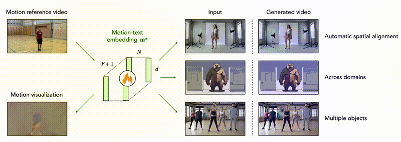

<h1 align="center">Reenact Anything</h1>
<h2 align="center">Semantic Video Motion Transfer Using Motion-Textual Inversion</h2>

<p align="center">
  <strong>⚠️ Unofficial Implementation</strong>
</p>

<p align="center">
  This repository contains an <strong>unofficial implementation</strong> of the paper:
</p>

<p align="center">
  <strong>"Reenact Anything: Semantic Video Motion Transfer Using Motion-Textual Inversion"</strong>
</p>

<p align="center">
  <a href="https://mkansy.github.io/reenact-anything/">
    
  </a>
  <a href="https://arxiv.org/abs/2501.02600">
    
  </a>
  <a href="https://arxiv.org/pdf/2501.02600">
    
  </a>
</p>

<p align="center">
  <strong>Original Authors:</strong> Manuel Kansy<sup>1,2</sup>, Jacek Naruniec<sup>2</sup>, Christopher Schroers<sup>2</sup>, Markus Gross<sup>1,2</sup>, Romann M. Weber<sup>2</sup><br>
  <sup>1</sup>ETH Zürich, <sup>2</sup>DisneyResearch|Studios, Switzerland
</p>

<p align="center">
  
</p>

---

## Overview

Unofficial PyTorch implementation of semantic video motion transfer using motion-textual inversion. Learns motion embeddings from reference videos and applies them to target images.

**Features:**
- Motion inversion for learning motion from reference videos 
- Semantic motion transfer to arbitrary images
- Support for full-body, face, camera, and hand-crafted motions
- Based on Stable Video Diffusion (SVD)

## Installation

```bash
conda env create -f environment.yml
```

## Usage

### Motion Inversion (`train_reenact.py`)

Learns motion embeddings from a reference video.

```bash
python train_reenact.py \
  --video_to_inverse ./assets/reenact_motions/reenact_jump.mp4 \
  --validation_images_path ./assets/reenact_targets/jump \
  --output_dir ./outputs/reenact_jump
```

**Key Arguments:**
- `--video_to_inverse` (required): Path to reference motion video (`.mp4`)
- `--validation_images_path`: Directory with validation images
- `--output_dir`: Output directory for embeddings and checkpoints
- `--num_tokens_in_motion_features`: Number of tokens (default: 5)
- `--max_train_steps`: Training steps (default: 5000)
- `--checkpointing_steps`: Save checkpoint every N steps (default: 500)
- `--validation_steps`: Run validation every N steps (default: 500)
- `--loss_type`: `l2`, `l1`, or `l1_weighted` (default: `l2`)
- `--seed`: Random seed (default: 0)
- `--report_to`: `wandb` or `tensorboard` (default: `wandb`)

### Motion Transfer (`inference_only.py`)

Applies learned motion embeddings to target images.

```bash
python inference_only.py \
  --motion_embedding_path ./outputs/reenact_jump \
  --validation_images_path ./assets/reenact_targets/jump \
  --output_dir ./outputs/reenact_jump_inference
```

**Key Arguments:**
- `--motion_embedding_path` (required): Path to embeddings directory or `.pt` file
- `--validation_images_path`: Directory with target images
- `--output_dir`: Output directory (default: same as motion_embedding_path)
- `--seed`: Random seed (default: 0)
- `--report_to`: `wandb` or `tensorboard` (optional)

**Checkpoint Selection:** If `--motion_embedding_path` is a directory, the script uses the most recent checkpoint. To use a specific checkpoint:
```bash
python inference_only.py \
  --motion_embedding_path ./outputs/reenact_jump/motion_embedding_3000.pt \
  --validation_images_path ./assets/reenact_targets/jump
```

## Data Structure

- **Video**: Direct path to `.mp4` file (e.g., `./assets/reenact_motions/reenact_jump.mp4`)
- **Images**: Directory containing `.png` or `.jpg` files (e.g., `./assets/reenact_targets/jump/`)

## Workflow

1. Prepare reference video (`.mp4` file)
2. Prepare target images directory
3. Run `train_reenact.py` to learn motion embeddings
4. Run `inference_only.py` to generate videos with transferred motion

## Technical Details

- **Base Model**: Stable Video Diffusion (SVD)
- **Training**: Motion embeddings optimized via diffusion loss (base model frozen)
- **Inference**: Learned embeddings injected into SVD pipeline

## Limitations

This implementation does not include data augmentations used in the original paper. Results may differ from the original.

## Citation

```bibtex
@inproceedings{kansy2025reenact,
  title={Reenact anything: Semantic video motion transfer using motion-textual inversion},
  author={Kansy, Manuel and Naruniec, Jacek and Schroers, Christopher and Gross, Markus and Weber, Romann M},
  booktitle={Proceedings of the Special Interest Group on Computer Graphics and Interactive Techniques Conference Conference Papers},
  pages={1--12},
  year={2025}
}
```

## License

This implementation is provided for research purposes. Please refer to the original paper's license and the Stable Video Diffusion model's license for usage terms.

## Acknowledgments

Unofficial implementation of "Reenact Anything: Semantic Video Motion Transfer Using Motion-Textual Inversion" by Kansy et al. Project page: [https://mkansy.github.io/reenact-anything/](https://mkansy.github.io/reenact-anything/)

Based on [SVD_Xtend](https://github.com/pixeli99/SVD_Xtend) by [pixeli99](https://github.com/pixeli99).
